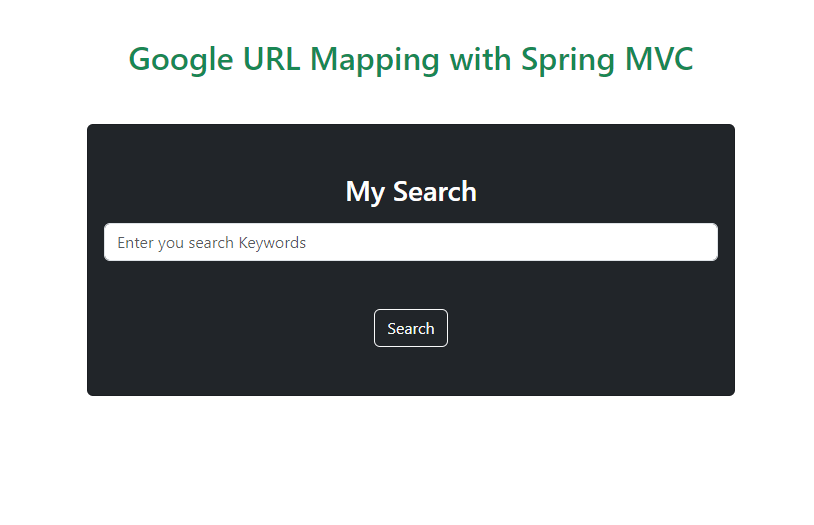

# Google URL Mapping with Spring MVC: Query Processor

## Overview

This project is a web application developed using Spring MVC that provides a URL mapping functionality for Google URLs and processes queries sent through POST requests...

## Features
- URL Mapping: The application can map Google URLs, allowing users to access specific web pages with cleaner and more user-friendly URLs.
- Query Processing: Queries are processed through POST requests, enabling users to perform searches efficiently and retrieve accurate results.

## Getting Started

### Installation

1. Clone the repository 
2. Build the project using Maven:
3. Deploy the application on a servlet container (e.g., Apache Tomcat).
4. Access the application in your web browser at: `http://localhost:8080`

## Contributing

Contributions to this project are welcome! If you find any bugs or have suggestions for improvements, please open an issue or submit a pull request.

